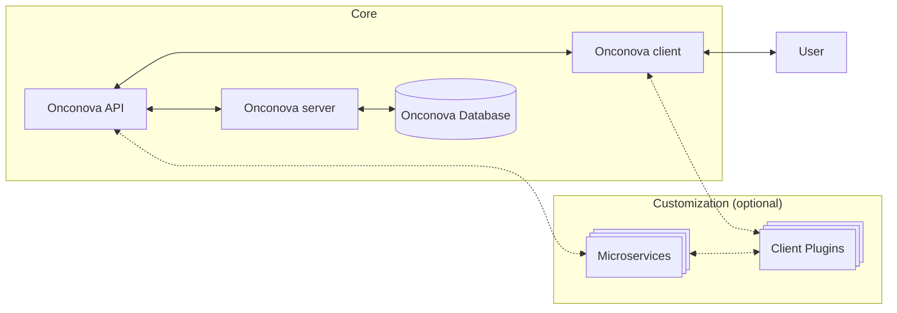
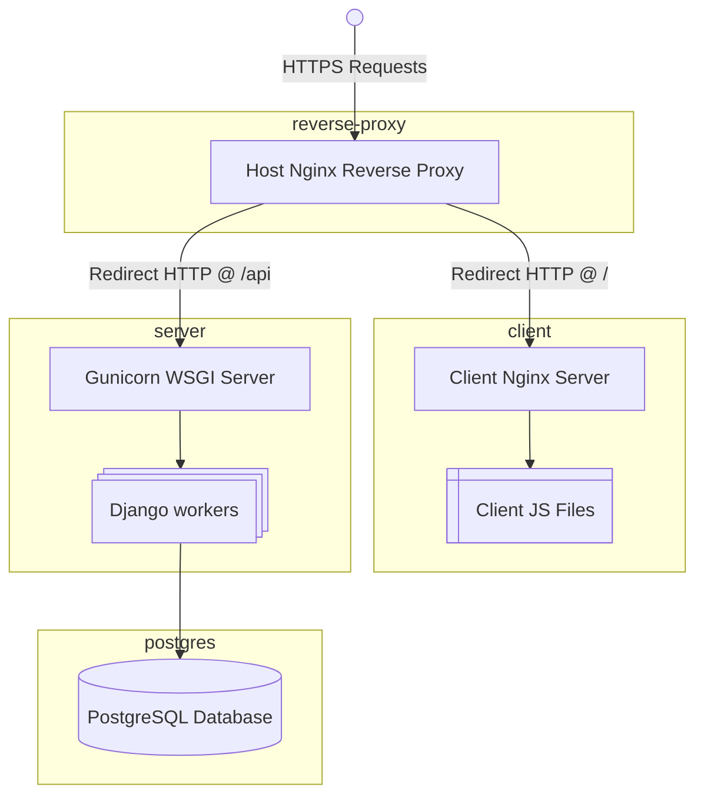

# Project Overview

Onconova is an open-source software project initially developed at the Univserity Hospital of Zurich designed to support data-driven precision oncology research. It provides a secure, structured, and scalable framework for capturing clinical data from oncology patients, while enabling users to explore and analyze aggregated data through an interactive web interface.

## Goals 

The primary aim of Onconova is to simplify and help standardize how clinical oncology data is collected, organized, and analyzed. By offering an open-source, containerized platform, Onconova allows institutions and research teams to:

- Capture structured clinical data from oncology patient records.
- Aggregate and analyze data interactively through a modern web interface.
- Facilitate cohort-building and outcome studies based on real-world data.
- Support precision medicine initiatives by surfacing actionable insights from clinical practice data.

## How It Works
Onconova consists of two main components:

- A Django-based API server that manages clinical data models, authentication, and API endpoints.
- An Angular web client that provides interactive data entry, cohort selection, and data visualization tools.

Both components are containerized using Docker and orchestrated via Docker Compose, making deployment flexible and reproducible across local and production environments.

## Why Open Source?
We believe that the future of precision oncology depends on collaborative, interoperable, and transparent tools. By releasing Onconova as an open-source project, we aim to:

- Accelerate clinical research innovation.
- Enable reproducible, multi-institutional studies.
- Lower the barriers for healthcare organizations to adopt precision oncology data infrastructure.

Foster a community of contributors to improve and extend the platform.

## Architecture

This section describes the high-level architecture of the Onconova platform, including its core components, optional extensions, and the way users and services interact.

#### Core Components

- **Onconova Server** - The backend service responsible for handling business logic, API processing, and database interactions. It exposes the Onconova API to facilitate communication with the client and optional microservices.
- **Onconova Client** - A frontend application, a single-page application (SPA), that provides the user interface. It communicates with the Onconova API to fetch or send data and display dynamic content to the user.
- **Onconova API** - An API layer that acts as the communication bridge between the client and the server. It provides endpoints for retrieving data, submitting forms, managing user actions, and invoking server-side business logic.
- **Onconova Database** - A relational database responsible for persistent data storage. It is accessed by the Onconova Server to read and write application data.

#### Customization Components

- **Microservices** - Independent, decoupled services that can extend or augment the core API functionality. These may handle specific business domains, integrations, or asynchronous processes. They communicate bidirectionally with the **Onconova API** and, optionally, with **Client Plugins**.
- **Client Plugins** - Custom client-side extensions or modules that enhance or modify the behavior of the Onconova Client. These plugins can also interact directly with microservices for advanced client-side features like live data feeds, third-party integrations, or UI customizations.

## Component Orchestration

This architecture represents a web-based platform composed of multiple interconnected services orchestrated within Docker containers, centered around an Nginx reverse proxy.

User Interaction

- A user initiates an HTTPS request from their browser or API client.
- The request first reaches the Host Machine’s Nginx Reverse Proxy (`onconova-reverse-proxy`).

Nginx Reverse Proxy (`reverse-proxy`)

- Acts as a secure entry point for all incoming HTTPS traffic.
- Based on the URL path of the request, Nginx routes the traffic to one of three destinations:

   + `/` → the Client Application (`client`).
   + `/api` → the API service (`server`).

Client Application (`client`)

- Requests sent to `/` are proxied to a Client Nginx Server running within the `client` container.
- This server serves static frontend assets like JavaScript, CSS, and HTML files for the single-page application (SPA).
- The actual application files reside in a directory labeled Client JS Files in the diagram.

API Service (`server`)

- Requests sent to `/api` are proxied to the Gunicorn WSGI Server within the `server` container.
- Gunicorn handles these requests by distributing them to multiple Django worker processes.
- Each worker runs a Django application instance capable of processing API requests.

PostgreSQL Database (`database`)

- All database queries generated by the Django workers are sent to a PostgreSQL database hosted in the `database` container.
- The PostgreSQL instance serves as the primary relational database for persisting and retrieving application data.