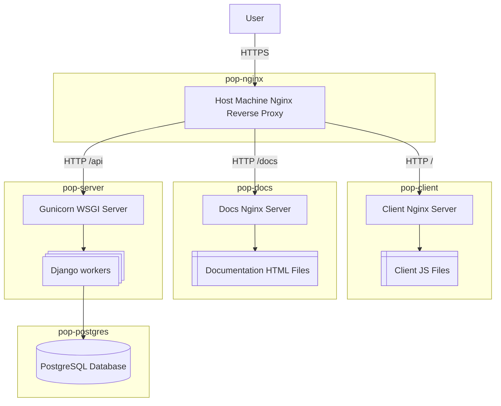

# Project Overview

## Digital Architecture

This architecture represents a web-based platform composed of multiple interconnected services orchestrated within Docker containers, centered around an Nginx reverse proxy.

User Interaction

- A user initiates an HTTPS request from their browser or API client.
- The request first reaches the Host Machine’s Nginx Reverse Proxy (pop-nginx).

Nginx Reverse Proxy (`pop-nginx`)

- Acts as a secure entry point for all incoming HTTPS traffic.
- Based on the URL path of the request, Nginx routes the traffic to one of three destinations:

   + `/` → the Client Application (`pop-client`).
   + `/api` → the API service (`pop-server`).
   + `/docs` → the Documentation service (`pop-docs`).

Client Application (`pop-client`)

- Requests sent to / are proxied to a Client Nginx Server running within the pop-client container.
- This server serves static frontend assets like JavaScript, CSS, and HTML files for the single-page application (SPA).
- The actual application files reside in a directory labeled Client JS Files in the diagram.

Documentation Service (`pop-docs`)

- Requests sent to /docs are forwarded to a Docs Nginx Server inside the pop-docs container.
- This Nginx server serves static documentation assets, represented as Documentation HTML Files.

API Service (`pop-server`)

- Requests sent to /api are proxied to the Gunicorn WSGI Server within the pop-server container.
- Gunicorn handles these requests by distributing them to multiple Django worker processes.
- Each worker runs a Django application instance capable of processing API requests.

PostgreSQL Database (`pop-postgres`)

- All database queries generated by the Django workers are sent to a PostgreSQL database hosted in the pop-postgres container.
- The PostgreSQL instance serves as the primary relational database for persisting and retrieving application data.